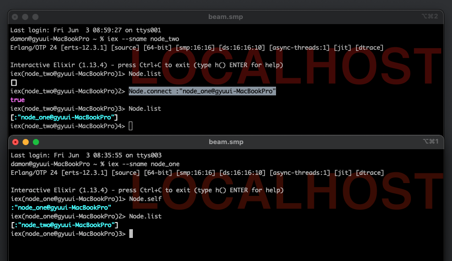

# elixir-study

## commands
### normal
1. `mix new {project_name}`
2. `mix --sup new {project_name}` : supervisor project
3. `mix format`

### in project
1. `mix deps`: dependencies 확인
2. `mix deps.get`: dependencies 다운로드
3. `mix test`
4. `mix escript.build`: 바이너리로 빌드

### githubfetch project
1. `iex -S mix`: mix project를 컴파일하며 iex 실행
2. `Issues.GithubIssues.fetch("elixir-lang", "elixir")`
3. `Issues.GithubIssues.process {"pragdave", "earmark", 1}`
4. 5번 project에서 `mix docs`: docs 제작

### spawn
1. `elixir --erl "+P 1000000" -r spawn/chain.exs -e "Chain.run(1000000)"` 

### node
1. `iex --name jujumilk3@gyudoza.local`
2. `iex --sname gyudoza`
3. `iex> Node.self`
4. node connection
   1. `iex --sname node_one`
   2. `iex --sname node_two`
   3. `Node.list`
   4. `Node.connect :"node_one@{node_one_address}"`
   5. `Node.list`
   6. If connected, Node two knows Node one.
   7. 

### duper project
1. `mix run --no-halt`
2. `time mix run --no-halt > dups.out`

## references
1. [가드 조건절에서 사용할 수 있는 것들](https://hexdocs.pm/elixir/1.13.4/Kernel.html#guards)
2. 